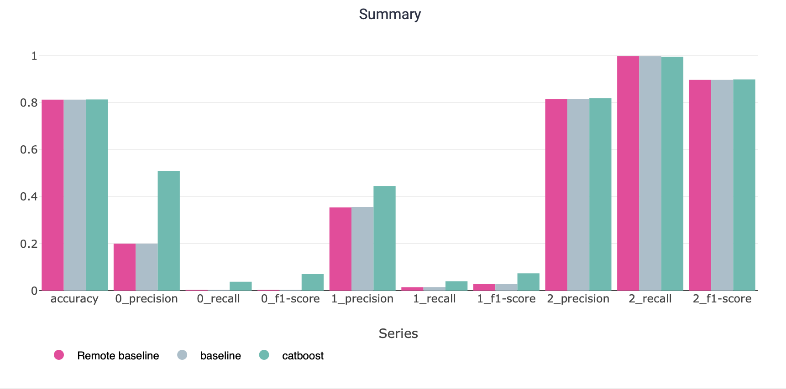
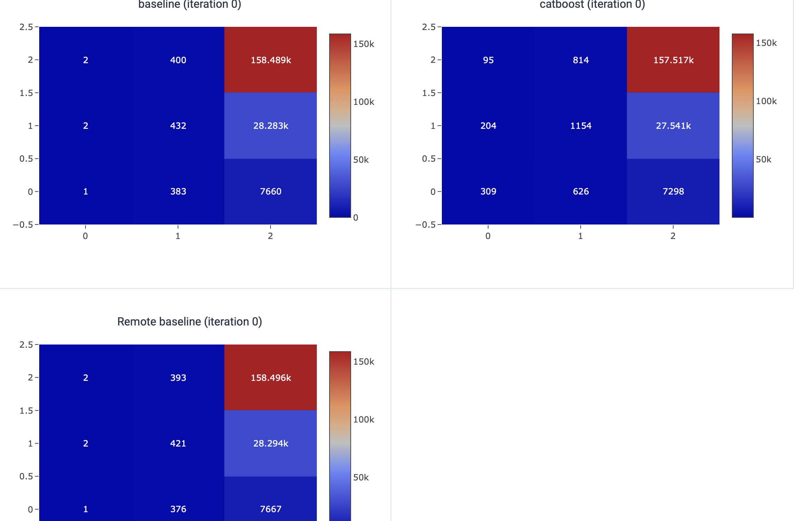
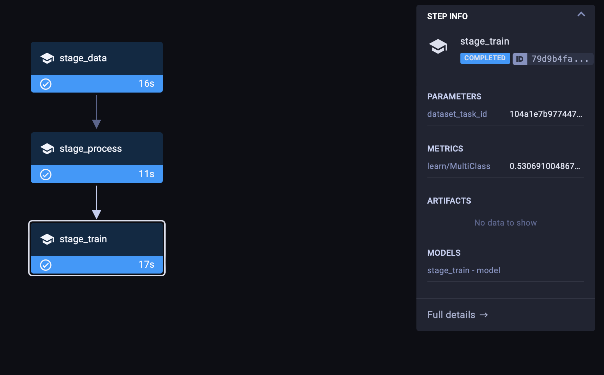

# Clear ML research
```commandline
docker compose --project-directory src/clearml/. up
```
http://localhost:8080
settings -> workspace -> create credentials
```commandline
clearml-init
clearml-data create --project "Mlops-test" --name "Raw data"
clearml-data add --files src/mlops_ods/dataset/2015-street-tree-census-tree-data.csv
clearml-data upload
clearml-data close

export PYTHONPATH='src'
python src/clear_ml

poetry add clearml-agent
nano ~/clearml.conf
clearml-agent daemon --detached --queue default

clearml-agent daemon  --stop
```
* log_reg: baseline
* log_reg with other params: Remote baseline
* catboost: from notebook



Catboost predicts all 3 classes better than log reg (predicts only class 2 good, and bad others, especially class 0)

In pipeline:

