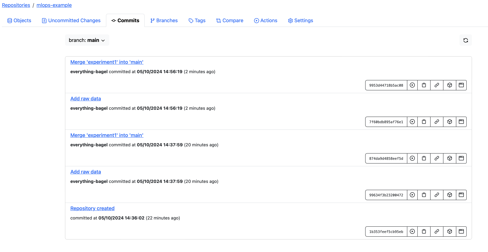

# lake fs research

```commandline
docker compose --project-directory src/lakefs/. up

docker run --name lakefs \
             --rm --publish 8000:8000 \
             treeverse/lakefs:latest \
             run --local-settings
```
two different preprocessing of data:

