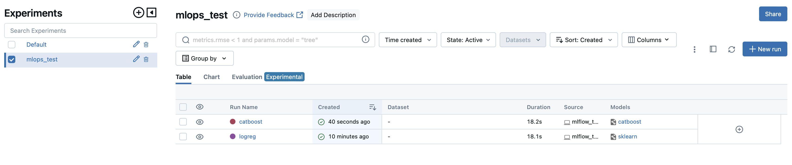
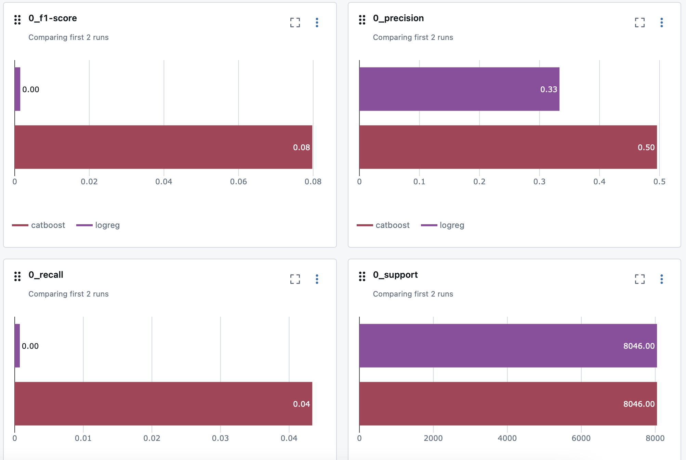
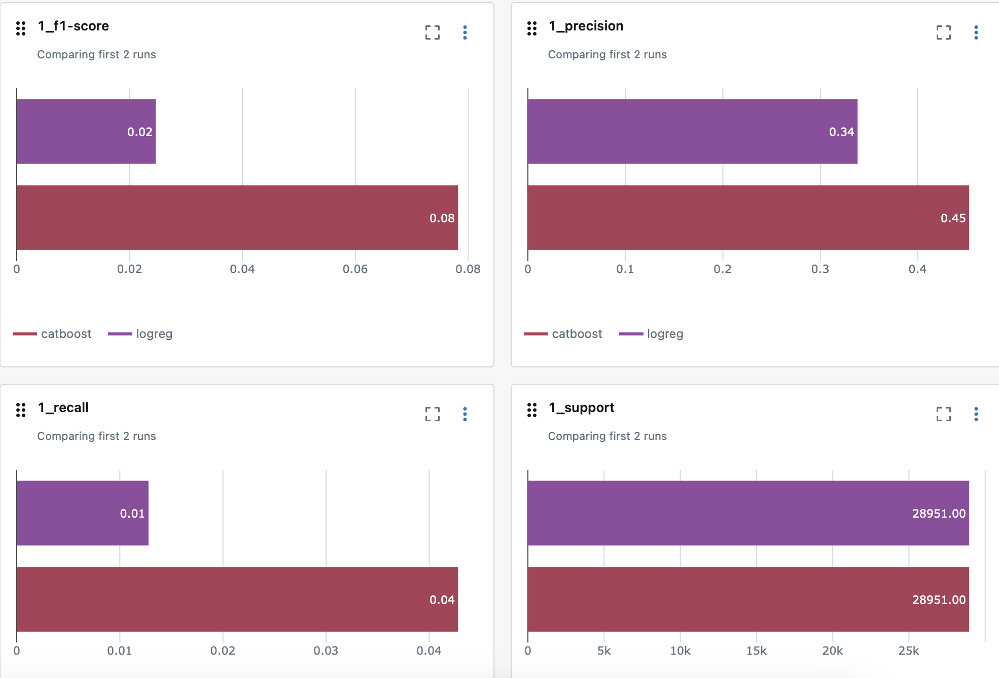
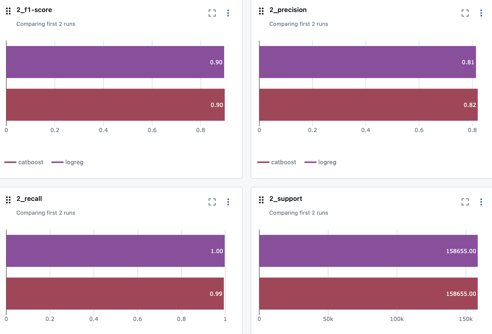

# MLFlow research
```commandline
mlflow server --host 127.0.0.1 --port 8080
```
### log_reg vs catboost for classification task
(probability of trees to be alive, normal or dead)

Comparison of metrics:



Catboost predicts better classes 0 and 1, so it's better to choose this model for usage
